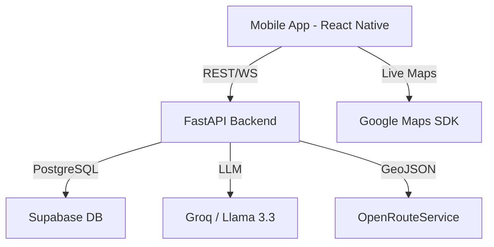

# Digvijay Express — Intelligent Logistics Tracking

> A premium, end-to-end shipment monitoring platform designed for high-stakes logistics. Powered by React Native and FastAPI, featuring real-time GPS telemetry and AI-driven status management.

[](https://expo.dev)
[](https://fastapi.tiangolo.com)
[](https://supabase.com)
[](https://groq.com)

---

## 🌐 Overview

Digvijay Express is a mission-critical B2B application tailored for inter-state logistics operations in India. It bridges the gap between field personnel, administrative hubs, and enterprise clients by providing a single source of truth for every shipment manifest.

### High-Level Architecture


---

## ✨ Core Features

### 🏢 Operations Command Center (Admin)
*   **Intelligent Dashboard:** Real-time visibility into active, in-transit, and completed manifests.
*   **AI Copilot:** An agentic assistant that answers operational queries and generates professional customer updates from raw field notes.
*   **Dynamic Assignment:** Seamlessly assign pickup and delivery drivers to specific legs of the journey.
*   **Archive & Analytics:** Comprehensive search and filtering of historical shipment data.

### 🚛 Precision Field Operations (Employee)
*   **Role-Based Workflows:** Distinct interfaces for Pickup and Delivery drivers based on assignment.
*   **Live Telemetry:** High-precision GPS tracking with background persistent monitoring.
*   **GPS Guard:** Automated system alerts if location services are disabled during active transit.
*   **One-Tap Transitions:** Simplified phase updates (Picked Up, Handed to Carrier, Delivered).

### 📦 Client Visibility Portal (Customer)
*   **Live Tracking:** Interactive map showing the real-time location of the carrier vehicle.
*   **Visual Timeline:** Transparent 5-stage progress rail from pickup to final delivery.
*   **AI-Enhanced Updates:** Professional status reports generated by the operations team.
*   **Manifest Details:** Access to transport modes (Air/Train), transport numbers, and ETA.

---

## 🛠 Tech Stack

| Layer | Technology | Rationale |
|-------|-----------|-----------|
| **Frontend** | React Native (Expo) | Cross-platform performance and rapid iteration via Expo Router. |
| **Backend** | FastAPI (Python) | High-concurrency support and seamless integration with AI models. |
| **Real-time** | WebSockets | Low-latency telemetry updates for live GPS tracking. |
| **Database** | Supabase (PostgreSQL) | Robust relational data with powerful role-based access control. |
| **AI Layer** | Llama 3.3 (Groq) | State-of-the-art inference for status generation and data analysis. |
| **Geo/Maps** | OpenRouteService | Enterprise-grade routing, polyline generation, and ETA calculation. |

---

## 🚀 Installation & Setup

### Prerequisites
*   Node.js 18+ & Python 3.11+
*   Expo Go app (for local development)
*   Supabase Account & Groq API Key

### 1. Repository Setup
```bash
git clone https://github.com/SatyamChaturvedi39/DGVJ-Shipment-Tracker.git
cd DGVJ-Shipment-Tracker
```

### 2. Frontend Configuration
```bash
# Install dependencies
npm install --legacy-peer-deps

# Configure environment
cp .env.example .env # Update with your API URLs

# Run dev server
npx expo start
```

### 3. Backend Configuration
```bash
cd backend
python -m venv venv
source venv/bin/activate # or venv\Scripts\activate on Windows

# Install core requirements
pip install -r requirements.txt

# Launch API server
uvicorn main:app --reload
```

---

## 🏗 Deployment Guide

### API Deployment (Render.com)
The backend is optimized for Render's Python environment.
1. Create a **Web Service** pointing to the `backend` directory.
2. Configure `SUPABASE_URL`, `SUPABASE_SERVICE_KEY`, and `GROQ_API_KEY`.
3. Set the build command to `pip install -r requirements.txt` and start command to `uvicorn main:app --host 0.0.0.0 --port $PORT`.

### Mobile Deployment (EAS)
Generate the production Android manifest via Expo Application Services:
```bash
eas build --profile preview --platform android
```

---

## 📄 License

This software is the proprietary property of **Digvijay Express, Bengaluru**. All rights reserved. For licensing inquiries, please contact the repository owner.

---
*Built with precision for the future of Indian logistics.*
