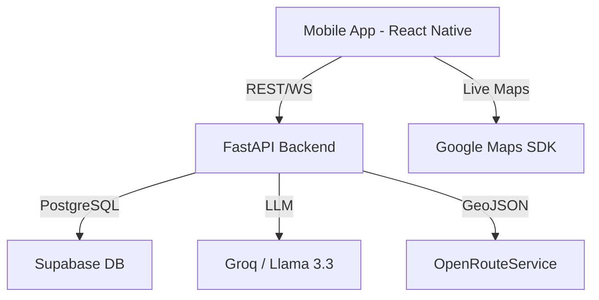

# Digvijay Express — Intelligent Logistics Tracking

> A premium, end-to-end shipment monitoring platform designed for high-stakes logistics. Powered by React Native and FastAPI, featuring real-time GPS telemetry and AI-driven status management.

---

## 🌐 Overview

Digvijay Express is a mission-critical B2B application tailored for inter-state logistics operations in India. It bridges the gap between field personnel, administrative hubs, and enterprise clients by providing a single source of truth for every shipment manifest.

### High-Level Architecture

---

## ✨ Core Features

### 🏢 Operations Command Center (Admin)
*   **Intelligent Dashboard:** Real-time visibility into active, in-transit, and completed manifests.
*   **AI Copilot:** An agentic assistant that answers operational queries and generates professional customer updates from raw field notes.
*   **Dynamic Assignment:** Seamlessly assign pickup and delivery drivers to specific legs of the journey.
*   **Archive & Analytics:** Comprehensive search and filtering of historical shipment data.

### 🚛 Precision Field Operations (Employee)
*   **Role-Based Workflows:** Distinct interfaces for Pickup and Delivery drivers based on assignment.
*   **Live Telemetry:** High-precision GPS tracking with background persistent monitoring.
*   **GPS Guard:** Automated system alerts if location services are disabled during active transit.
*   **One-Tap Transitions:** Simplified phase updates (Picked Up, Handed to Carrier, Delivered).

### 📦 Client Visibility Portal (Customer)
*   **Live Tracking:** Interactive map showing the real-time location of the carrier vehicle.
*   **Visual Timeline:** Transparent 5-stage progress rail from pickup to final delivery.
*   **AI-Enhanced Updates:** Professional status reports generated by the operations team.
*   **Manifest Details:** Access to transport modes (Air/Train), transport numbers, and ETA.

---

## 🛠 Tech Stack

| Layer | Technology | Rationale |
|-------|-----------|-----------|
| **Frontend** | React Native (Expo) | Cross-platform performance and rapid iteration via Expo Router. |
| **Backend** | FastAPI (Python) | High-concurrency support and seamless integration with AI models. |
| **Real-time** | WebSockets | Low-latency telemetry updates for live GPS tracking. |
| **Database** | Supabase (PostgreSQL) | Robust relational data with powerful role-based access control. |
| **AI Layer** | Llama 3.3 (Groq) | State-of-the-art inference for status generation and data analysis. |
| **Geo/Maps** | OpenRouteService | Enterprise-grade routing, polyline generation, and ETA calculation. |

---

## 🔄 Operational Lifecycle: The Journey of a Shipment
The platform automates the entire lifecycle of a logistics manifest across five distinct operational phases:

1.  **📦 Pickup Phase**: Admin assigns a pickup driver. The driver receives a notification, starts tracking, and heads to the origin point.
2.  **🚗 Transit to Terminal**: Once goods are secured, the driver marks the shipment as "In Transit." Real-time GPS telemetry begins streaming to the customer portal.
3.  **✈ Handed to Carrier**: Goods are transferred to a long-haul carrier (Air or Train). The internal driver stops tracking, and the shipment enters a "wait" state.
4.  **🛵 Out for Delivery**: Upon arrival at the destination hub, a delivery driver is assigned. They pick up the goods and initiate the final leg of the journey.
5.  **✓ Successfully Delivered**: The driver captures the final status, the manifest is closed, and it is automatically moved to the secure Operations Archive.

---

## 🔒 Security & Access Architecture
As a private enterprise tool, Digvijay Express implements a rigorous security model to protect logistics data:

*   **Role-Based Access Control (RBAC)**: Distinct permission sets for Admins (Full Control), Employees (Task-Specific), and Customers (View-Only).
*   **Encrypted Telemetry**: All live GPS data is streamed via secure WebSockets and stored in an encrypted PostgreSQL database.
*   **Geofence Verification**: The system verifies driver location against assigned manifest origin/destination to ensure operational integrity.
*   **Zero-Knowledge Client Portal**: Customers can only access their specific shipment via unique, non-guessable tracking identifiers.

---

## 📄 Proprietary Notice
This application and its underlying source code are the exclusive intellectual property of **Digvijay Express**. 
*   **Commercial Use**: Strictly prohibited without written authorization.
*   **Redistribution**: Any unauthorized copying or distribution of this code will result in legal action.
*   **Contact**: For internal support or enterprise inquiries, contact the Digvijay IT Operations Hub.

---

---
*Built with precision for the future of Indian logistics.*
